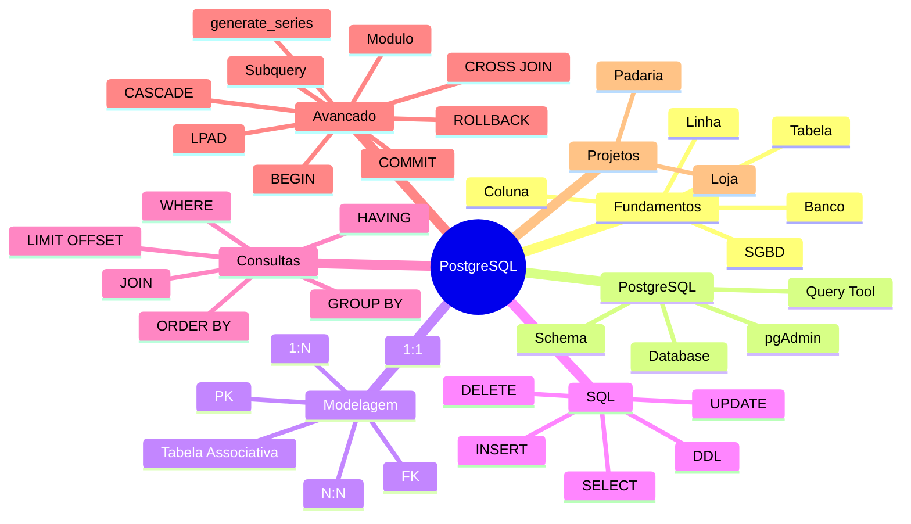

# 🧠 Mapa Geral

```mermaid
mindmap
  root((PostgreSQL))
    Fundamentos
      Banco
      SGBD
      Tabela
      Linha
      Coluna
    PostgreSQL
      pgAdmin
      Query Tool
      Database
      Schema
    Modelagem
      PK
      FK
      1:1
      1:N
      N:N
      Tabela Associativa
    SQL
      DDL
      INSERT
      SELECT
      UPDATE
      DELETE
    Consultas
      WHERE
      ORDER BY
      LIMIT OFFSET
      JOIN
      GROUP BY
      HAVING
    Avancado
      BEGIN
      COMMIT
      ROLLBACK
      CASCADE
      Subquery
      CROSS JOIN
      generate_series
      Modulo
      LPAD
    Projetos
      Loja
      Padaria
```
